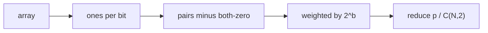

# EXPOR — solution

Accepted on SPOJ (0.14s, 5.2M).

## Forks

**Pair every pair.** `N` is `10^5`, `T` is `10`. About `N²/2` ORs. On the order of `5·10^9` even for one test. Dead at `0.55s`.

**Adjacent only.** The old `spoj_EXPOR.cpp` ORed `A[i]` with `A[i-1]` and weighted by index. Pairs are not neighbors. Wrong model.

**Split by bits.** OR does not carry. Bit `b` of `Ai | Aj` depends only on bit `b` of the two numbers. That is the fork we took.

## Bit by bit

```
E[Ai | Aj] = sum_b 2^b * P(bit b is set in Ai|Aj)
```

Bit `b` is set unless both numbers have it unset. Let `z` be how many values have bit `b` off, and `pairs = C(N, 2)`.

```
pairs_with_bit = pairs - C(z, 2)
```

Exact fraction, no floats:

```
p = sum_b 2^b * (C(N,2) - C(z_b, 2))
q = C(N, 2)
```

Reduce by `gcd(p, q)` and print `p/q`. One pass over the array counting how many times each of the 31 bits is on (`Ai < 2^31`, so bits `0..30`). Then 31 constant-time terms. `O(31 N)` per test, ~`3·10^7` ops. Comfortable in C++ if I/O is awake.



You never store the pairs. You never even need the original values after the bit counts.

## Tiny example

Official sample is too round (`0/1`, `3/1`). `[1, 0, 0]`:

Pairs: `1|0 = 1`, `1|0 = 1`, `0|0 = 0`. Sum `2`, `C(3,2) = 3` → **`2/3`**.

Only bit 0 is live. `z = 2`, `C(2,2) = 1`, `p = 1 · (3 - 1) = 2`, `q = 3`. Matches.

`[1, 2, 3]`:

- `1 = 01`, `2 = 10`, `3 = 11`
- Bit 0: `z = 1` (the `2`), `C(1,2) = 0`, all three pairs have the bit
- Bit 1: same
- `p = 1·3 + 2·3 = 9`, `q = 3` → `3/1`

Every pair really is `3`.

## Why the code is careful

The idea does not fail. The width of `p` does.

- **Unsigned.** Max `p` is `(2^31 - 1) · C(1e5, 2) ≈ 1.07·10^19`. Signed `i64` tops out at `9.22·10^18`. Unsigned `u64` fits (`1.84·10^19`). That is the WA magnet the SPOJ comments point at.
- **Keep the `C(n,2) - C(z,2)` form.** Writing `2^b * cnt1 * (2N - cnt1 - 1)` without the `/2` overflows even `u64` at bit 30.
- **`gcd(0, q) = q`.** All zeros already prints `0/1`. No special case.
- **`N` is per test.** The old file read it once.

## Insight

OR is linear over bits. A bit’s expectation is just how many pairs are not both zero. Unsigned is the implementation footnote, not the idea.

## After AC — what could still improve

The accepted code is already in the right complexity class. The judge ran it in **0.14s / 5.2M** against a 0.55s limit. What is left is polish, not a new algorithm. Do not rewrite the accepted code unless asked.

**Time.** The work is one `N × 31` pass counting set bits, then 31 constant-time terms. `sync_with_stdio(false)` is already on. A custom scanner would shave the reads, not the counts.

Still on the table:

- **Sparse bits.** `while (a) { ones[ctz(a)]++; a &= a-1; }` only visits set bits. Helps when values are small. Invisible next to a 0.14s run.
- **Drop the array.** We already do not store `A`. The 31 counters are the whole working set.

**Memory.** 5.2M is the process, not the input. Thirty-one ints of counts, plus the binary, iostream, and allocator slack. There is nothing to pack.

**Clarity.** A `pairs_with_bit(zeros, n)` helper would make `main` “count, then weight by `2^b`.” The gcd helper is already the right empty-numerator path (`gcd(0, q) = q`).

None of this is worth a second submission. The bound that mattered was “do not pair every pair.” After that, the judge is no longer the bottleneck.
